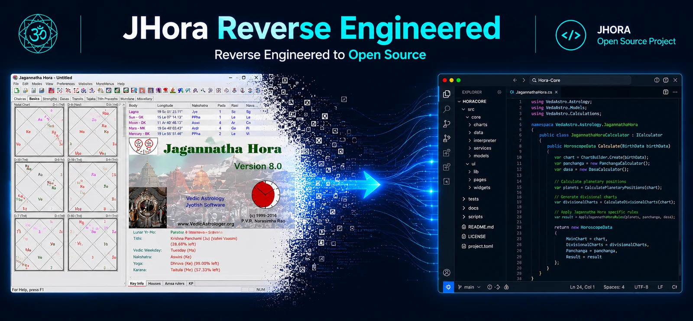

<p align="center">
  
</p>

# Natal Chart Rasi — Jagannatha Hora Reverse Engineered

Get the data behind a Jagannatha Hora (JHora)-style natal Rāśi chart with a few lines of JavaScript and a simple HTTPS request.

This is the first small, public example from VedAstro's work to study JHora's previously desktop-only calculation workflow and make the recovered behavior easy to consume through open web APIs.

## What was unlocked?

The natal Rāśi chart—also called the D-1 chart—is the foundation of a Vedic horoscope. The recovered workflow can be expressed as two reusable calculations:

- `AllPlanetRasiSigns` returns the sidereal sign and degree of the Sun, Moon, Mars, Mercury, Jupiter, Venus, Saturn, Rāhu, and Ketu.
- `AllHouseRasiSigns` returns the sign and degree of all twelve houses. `House1` is the Lagna or Ascendant.

Together, those two responses contain the placements needed to construct the natal Rāśi chart.

## Run the JavaScript example

You need [Node.js 18 or newer](https://nodejs.org/). There are no packages to install and no API key is required for this example.

```bash
git clone https://github.com/VedAstro/Natal-Chart-Rasi-Jagannatha-Hora-Reverse-Engineered.git
cd Natal-Chart-Rasi-Jagannatha-Hora-Reverse-Engineered
npm start
```

The default command uses POST with exact latitude and longitude. Edit `birthDetails` near the top of [`index.js`](./index.js) to use your own date, time, UTC offset, and location.

Example output begins like this:

```json
{
  "chart": "Natal Rasi (D-1)",
  "requestMethod": "POST",
  "ayanamsa": "LAHIRI",
  "ascendant": "Capricorn : 25° 20' 47",
  "planets": {
    "Sun": "Virgo : 29° 27' 25",
    "Moon": "Aquarius : 9° 46' 4"
  }
}
```

The actual output includes all nine planets and all twelve houses.

## Use HTTPS POST

POST is recommended because it sends precise coordinates instead of asking the API to resolve a place name.

```js
const response = await fetch(
  "https://api.vedastro.org/api/Calculate/AllPlanetRasiSigns",
  {
    method: "POST",
    headers: { "Content-Type": "application/json" },
    body: JSON.stringify({
      Ayanamsa: "LAHIRI",
      Time: {
        StdTime: "14:20 16/10/1918 +05:30",
        Location: {
          Name: "Bangalore, India",
          Longitude: 77.5946,
          Latitude: 12.9716
        }
      }
    })
  }
);

const data = await response.json();
console.log(data.Payload.AllPlanetRasiSigns);
```

Change the calculator name to `AllHouseRasiSigns` with the same body to retrieve the houses and Lagna.

## Use HTTPS GET

For a URL-only request, run:

```bash
npm run start:get
```

Or open this endpoint directly:

```text
https://api.vedastro.org/api/Calculate/AllPlanetRasiSigns/Location/Bangalore,India/Time/14:20/16/10/1918/%2B05:30/Ayanamsa/LAHIRI
```

Replace `AllPlanetRasiSigns` with `AllHouseRasiSigns` for the houses. In a GET request, the API resolves the location name to coordinates. Use POST when exact coordinates are important.

## Request and response notes

- `StdTime` uses `HH:mm DD/MM/YYYY ±HH:mm` and must include the historical UTC offset at the birthplace.
- This example uses the Lahiri ayanāṃśa, matching the common JHora configuration. A different ayanāṃśa changes the sidereal positions.
- Successful responses use the envelope `{ "Status": "Pass", "Payload": ... }`.
- Astrology software settings and ephemeris versions matter. For reproducible comparisons, keep the time, coordinates, UTC offset, ayanāṃśa, and node settings identical.

## Why this repository exists

JHora made a vast body of Vedic astrology calculations available in a desktop application. VedAstro is documenting the recovered calculation behavior in small, testable pieces and exposing those pieces as ordinary JSON over HTTPS—usable from JavaScript, Python, mobile apps, research notebooks, and AI tools.

Explore the wider open-source project at [VedAstro.org](https://vedastro.org) and [github.com/VedAstro/VedAstro](https://github.com/VedAstro/VedAstro).

## Independence notice

This is an independent educational reverse-engineering project. Jagannatha Hora and JHora belong to their respective owner(s). This repository is not affiliated with or endorsed by the original application or its authors. It contains no original JHora program files or source code.

## License

[MIT](./LICENSE) © VedAstro
